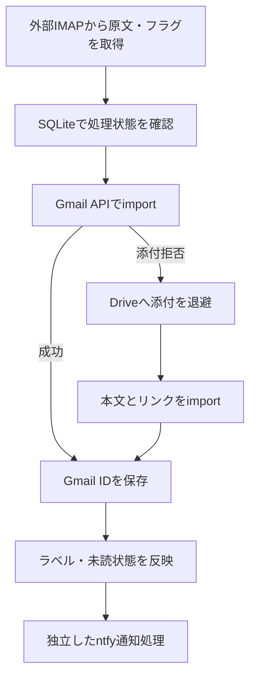

会社のメールをGmailで扱いたい。しかし、Gmailの外部POP取得には終了予定があり、そもそも接続先によってはPOPが使えません。

そこで、外部メールサーバーからIMAPでメールを取得し、Gmail APIで自分のGmailへ取り込む **Gmail Bridge** を作りました。Pythonで実装し、QNAP NASのContainer Stationで動かしています。

この記事では、導入コマンドだけでなく、「何をGmailへ集約したかったのか」と、取り込み・通知・障害復旧をどう分けたかを紹介します。

- ソース: https://github.com/sosboy-san/gmail_bridge
- 正式版: [v1.0.0](https://github.com/sosboy-san/gmail_bridge/releases/tag/v1.0.0)
- Docker Hub: https://hub.docker.com/r/sosboy/gmail-bridge
- ライセンス: MIT

記載内容は2026年9月30日時点です。実装はv1.0.0と現在の公開資料を確認しています。導入時は最新のReleaseと制限事項も確認してください。

## 背景：外部メールを「見る」と、Gmailへ「入れる」は違う

Gmailアプリへ外部のIMAPアカウントを追加すれば、スマートフォンでそのメールを読むことはできます。ただ、それだけで外部メールが自分のGmailアカウントに保存されるわけではありません。

今回欲しかったのは、外部メールを**本家Gmailのメールボックスに入れる**仕組みです。

| 方法 | メールの保存先 | 今回の目的との関係 |
| --- | --- | --- |
| Gmailアプリに外部IMAPアカウントを追加 | 外部メールサーバー | スマホで閲覧できるが、Gmail本体への取り込みとは別 |
| 外部サーバーからGmailへ自動転送 | Gmailにも届く | 転送が利用でき、運用条件が合えば有力な選択肢 |
| Gmail BridgeでIMAP → Gmail API | 外部サーバーからGmailへコピー | 自分で取り込み対象や状態管理を制御できる |

Gmail側へ保存できれば、出所をラベルで区別しながら、検索やWeb・モバイルでの閲覧をGmailに集約できます。Gmail純正フィルタを使った整理や、Gmail側のAI機能を利用することも、この方式を選んだ背景です。

ただし、フィルタの最終結果は通常受信と完全に同じとは限りません。AI機能もアカウント・契約・提供条件に依存し、このBridgeが有効化する機能ではありません。AIによる検索・要約の動作は、本記事で確認済みの機能としては扱いません。

### POP取得終了の対象と時期

Google公式の[変更案内](https://support.google.com/mail/answer/16604719?hl=en)では、Gmailが外部アカウントからPOPでメールを取得する機能は、新規ユーザーへの提供を2026年第1四半期後に終了し、既存ユーザーは2027年1月まで利用可能としています。[サードパーティアカウントのサポート変更](https://support.google.com/mail/answer/17101213?hl=ja)も確認してください。

対象はGmail側の「他のアカウントのメールを確認」です。外部クライアントからGmailのメールをPOP・IMAPで読む機能や、Gmail APIへのアクセスまで終了するという意味ではありません。

外部サーバーの自動転送が使えるなら、まずそちらを検討できます。Bridgeは、IMAPから取得してGmailへ保存する経路を自分で用意したい場合の選択肢です。

## 全体構成

通常の取り込みでは、IMAPから取得したRFC 822メール原文をGmail APIへ渡します。Gmailが添付を理由に取り込みを拒否した場合だけ、Google Driveへの退避に切り替えます。



コンテナ内の `app.service` が処理を繰り返し、各サイクル終了後に60秒待機します。IMAP IDLEによるプッシュ受信ではなく、定期巡回方式です。処理時間もあるため、厳密な60秒間隔ではありません。

設定とOAuthトークンに加え、SQLite DB・バックアップ・ログをホスト側へ永続化します。コンテナを作り直しても処理記録を失わない構成です。

## 設計で気をつけたこと

### 1. 元のメールを取得時に既読にしない

IMAP取得には `BODY.PEEK[]` を使います。Bridgeがメールを読んだだけで、元サーバー側の未読が消えるのを避けるためです。

取得時の `\Seen` フラグを確認し、元が未読ならGmailへ `UNREAD` ラベルを付けます。加えて、設定した出所ラベルを付けて、Gmail本来の受信メールと区別できるようにしました。

これは取得時点の状態を反映する処理です。取り込み後に元サーバーやGmailで既読状態を変えても、双方へ同期し続けるわけではありません。

### 2. Gmailへの保存には `messages.import` を使う

保存に使用しているのは [`users.messages.import`](https://developers.google.com/workspace/gmail/api/reference/rest/v1/users.messages/import) です。Googleの説明では、通常のメール配信に近いスキャン・分類を伴って、認証ユーザーのメールボックスへ取り込むAPIです。メールを相手に送信するAPIではありません。

実装の中心は次の呼び出しです。`raw` には、原文をbase64url形式にした値を渡します。

```python
result = (
    service.users().messages().import_(
        userId="me",
        body={"raw": raw},
        internalDateSource="dateHeader",
    ).execute()
)
gmail_message_id = result["id"]
```

GmailへのIMAPコピーではなく、このAPI経由で取り込み、Gmail側での整理につなげる設計にしました。

注意点は、取り込み後にBridge自身がラベルと未読状態を反映することです。たとえばGmailフィルタで既読にするルールと、Bridgeが未読を付ける処理は結果に影響します。使いたいフィルタは、少数の試験メールで確認する必要があります。

設定の `force_not_spam=true` は取り込み後のSPAMラベル解除であり、受信トレイへの強制投入ではありません。初期設定はfalseです。

### 3. 取り込みとラベル処理を一度に成功する前提にしない

メールの識別には、SQLiteへ `mailbox`・`UIDVALIDITY`・`UID` を保存します。UIDだけで管理せず、メールボックスとその世代を含めて識別する設計です。

Gmailへの取り込みが成功したら、Gmail IDをpending状態として保存し、その後でラベルなどを反映します。後半の処理が失敗した場合は、次回に保存済みIDから再開します。

ただし、**重複を完全に防ぐ保証はありません**。Gmail側で成功してからローカルDBへIDを保存するまでに停止すると、次回に再取り込みする可能性があります。外部APIとSQLiteを一つのトランザクションにはできないため、この短い区間は既知の制限として残しています。

### 4. 通知の失敗でメールを取り込み直さない

通知はntfyを利用し、メール取り込みとは別の状態として管理しています。

メールがGmailへ保存できた後に通知だけ失敗しても、メールを再importする必要はありません。次の巡回では、pendingになっている通知だけを再送します。

通知と保存を分けることで、「通知をもう一度送るためにメールが増える」という動作を避けています。Gmailアプリ自身の通知設定や配信条件とは別の通知経路です。

通常の新着通知にはメール本文や件名を含めません。ただしIMAP障害通知には接続エラーの文字列が含まれます。ntfyのtopicや認証情報は公開せず、アクセス制御を確認してから使います。

### 5. 添付退避は、添付拒否時だけ行う

Gmailが添付を拒否したと判定した場合、添付をDriveへ保存し、本文とDriveリンクを含む軽量メールを取り込みます。通信障害や、添付と無関係なAPIエラーまでDrive退避へ流す設計にはしていません。

この経路ではGmailに保存されるメールは原文そのものではなく、リンクを含む再構成メールです。また、Driveの共有権限を「誰でもアクセス可能」に変える処理はありません。リンク先を開くには権限を持つGoogleアカウントが必要です。

## Dockerで動かすまでの流れ

公開イメージは `linux/amd64` と `linux/arm64` に対応しています。現在の固定版は次で取得できます。

```bash
docker pull sosboy/gmail-bridge:1.0.0
```

`latest` などの追従タグもありますが、初回導入はバージョンを固定した方が、どの版を検証したか明確になります。

必要な準備は次の通りです。詳細は [INSTALL.md](https://github.com/sosboy-san/gmail_bridge/blob/main/INSTALL.md) と [DOCKER_RELEASE.md](https://github.com/sosboy-san/gmail_bridge/blob/main/DOCKER_RELEASE.md) にまとめています。

1. 自分のGoogle CloudプロジェクトでGmail APIとGoogle Drive APIを有効にする。
2. デスクトップアプリ用OAuthクライアントを作り、ブラウザを使えるPCで `make_token.py` を実行する。
3. `config.ini`、`credentials.json`、`token.json` と、永続化する `data/`・`backups/`・`logs/` を用意する。
4. 公開イメージ用Compose例をコピーし、マウント先とUID/GIDを実機へ合わせる。
5. 初期化方針を決めてから常駐を開始する。

設定・トークン・保存先を準備した後、Linuxホストで実行する流れは次のようになります。

```bash
cp docker-compose.image.example.yml docker-compose.yml
export BRIDGE_UID=$(id -u)
export BRIDGE_GID=$(id -g)

docker compose config --quiet
docker compose pull

# 最新1通を対象として確認。Gmail・Driveへの送信は行わない。
docker compose run --rm gmail-bridge python -m app.main init --latest 1 --dry-run

# 初回のみ：既存メールは取り込まず、以後の新着から開始する。
docker compose run --rm gmail-bridge python -m app.main init --from-now

docker compose up -d
```

ここで重要なのが初期化です。`init --from-now` は、現在あるメールのUIDをignoredとして記録します。過去メールも取り込む場合は `init --all` などを選びます。

一方、`init --latest 1` は範囲外のメールをignoredにしません。1通だけ試験取り込みした後に、そのまま通常runを始めると、残りの未処理の過去メールも対象になります。**「最新1通で試す」と「新着だけで運用を始める」は別の操作**です。既存DBで運用中の更新時には再初期化しません。

`init --dry-run` でもDBの作成・スキーマ移行は起こり得ます。また、`run --dry-run` はログ・DBバックアップ・IMAP障害／復旧通知が動くため、完全に無副作用なコマンドではありません。

## QNAPで動かして分かったこと

2026年9月30日の[正式Release](https://github.com/sosboy-san/gmail_bridge/releases/tag/v1.0.0)には、QNAP Container StationのGUIから公開イメージ1.0.0を導入し、定期実行、OAuth更新、新着1通の取り込み、ntfy通知成功をログで確認した結果を記録しています。

期限切れOAuthトークンを交換した後に、取り込みが再開することも確認しています。実際に動かすと、メール処理のコードだけでなく、認証の継続と永続ファイルの扱いが運用の要点になります。

### OAuthは初回認証だけでは終わらない

現在の実装は `https://mail.google.com/` と `drive.file` のスコープを使います。Gmail側は広い権限なので、認可内容を確認してください。

Googleの[OAuth説明](https://developers.google.com/identity/protocols/oauth2#expiration)では、ExternalかつTestingのアプリでこのようなスコープを使う場合、リフレッシュトークンは通常7日で期限切れになります。継続運用前に同意画面の公開状態と必要な手続きを確認する必要があります。

また、`token.json` は自動更新時に書き換えるため、読み取り専用マウントにはできません。設定ファイルを読めるだけでなく、トークンやDBを書き換えられる権限も必要です。

### 常駐と手動操作を重ねない

通常runにはLinuxの `flock` による排他がありますが、init・cleanupの手動実行まで一括で守るものではありません。手動で実行する際は常駐を止めます。同じDBを複数コンテナから使う運用もしません。

バックアップはUTC日付ごとに作り、最新14ファイルを保持します。cleanupの日次判定はコンテナのローカル日付で、Composeの既定はAsia/Tokyoです。「14ファイル保持」と「14暦日保持」が同じではないことも、運用上の注意点です。

## 検証範囲と、残っている制限

自動検証では、Linux上の32件のオフラインテストに加え、静的検査、Compose検証、Docker build、CLI起動、イメージ内のタイムゾーン検証を実施しています。通知だけの再送やpending再開などは、架空データとモックで検証しています。

これと、実サービスへ接続したQNAPでの確認は別です。Drive fallback、期限到来後の実削除、NAS・コンテナ再起動後の復帰など、全機能の実機試験が完了したという意味ではありません。

主な制限は次の通りです。

| 項目 | 現在の仕様・制限 |
| --- | --- |
| 実行環境 | LinuxコンテナまたはLinux上のPython 3.12。Windowsでの常駐は対象外 |
| IMAP接続 | STARTTLS方式のみ。993番の暗黙TLSやIMAP OAuthには未対応 |
| 取り込み対象 | 1設定につき1アカウント・1フォルダ。既定はINBOXで、再帰巡回しない |
| 同期 | 一方向の取り込み。既読状態や整理操作を継続的に相互反映しない |
| 重複 | API成功とDB保存の間の停止で発生し得る。Drive保存にも同様の区間がある |
| 終了コード | 個別メールの取り込みが失敗してもrunが0で終了する場合がある。ログ・状態確認が必要 |
| 復旧通知 | IMAP復旧通知の送信失敗には、専用の再送処理がない |
| 元メールの削除 | 初期設定は無効。UIDPLUS非対応では他クライアントとのEXPUNGE競合を完全には防げない |
| 送信・返信 | 外部アドレスでの送信を代替するツールではない。返信経路は別途用意する |

削除を使う場合は、Gmailへの取り込み完了後に猶予期間を置き、UIDVALIDITYや削除対象などを確認するcleanupを利用します。それでも初回から有効にせず、コピーの内容と添付を確認してから、専用の試験メールで検証してください。

実設定、OAuthトークン、DB、ログ、メール原文、添付はGitHubへ公開しません。業務メールをGmailやDriveへ移す場合は、所属組織のルールにも従ってください。

## おわりに

今回の中心は、外部メールを読むアプリを増やすことではなく、メールの保存先と整理の場所をGmailへ集約することでした。

IMAPから原文を取得してGmail APIへ渡す部分に加え、取り込み後の処理を再開できる状態管理、通知だけの再送、OAuth更新、永続データの保持まで含めて、常駐運用の仕組みを整えました。

同じように「外部メールをGmail本体へ入れたい」と考えている方が、自動転送・アプリへのアカウント追加・自前のBridgeを比較する際の参考になればと思います。

設計整理、ドキュメント作成、公開準備にはChatGPTを活用しています。

## 参考資料

- [Gmail Bridge README](https://github.com/sosboy-san/gmail_bridge)
- [Gmail Bridge v1.0.0 Release](https://github.com/sosboy-san/gmail_bridge/releases/tag/v1.0.0)
- [リリースノート](https://github.com/sosboy-san/gmail_bridge/blob/v1.0.0/RELEASE_NOTES.md)
- [導入手順](https://github.com/sosboy-san/gmail_bridge/blob/main/INSTALL.md)
- [Docker公開・導入資料](https://github.com/sosboy-san/gmail_bridge/blob/main/DOCKER_RELEASE.md)
- [GmailifyとPOPの変更に関するGoogle公式案内](https://support.google.com/mail/answer/16604719?hl=en)
- [サードパーティメールアカウントのサポート変更](https://support.google.com/mail/answer/17101213?hl=ja)
- [Gmail API: users.messages.import](https://developers.google.com/workspace/gmail/api/reference/rest/v1/users.messages/import)
- [Google OAuth: Refresh token expiration](https://developers.google.com/identity/protocols/oauth2#expiration)
