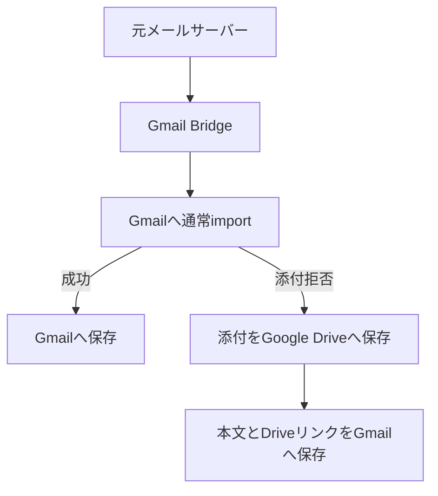

Gmailの外部POP取得終了に備えて、会社メールなどを**本家Gmailへ取り込むためのセルフホスト型Bridge**を作りました。

名前はそのまま **Gmail Bridge** です。

- GitHub: https://github.com/sosboy-san/gmail_bridge
- Release: https://github.com/sosboy-san/gmail_bridge/releases/tag/v1.0.0
- Docker Hub: https://hub.docker.com/r/sosboy/gmail-bridge
- License: MIT

Pythonで実装し、現在はQNAP NASのContainer Station上で実際に運用しています。

この記事では細かな実装解説よりも、

**なぜわざわざBridgeを作ったのか**

を中心に書きます。

## きっかけはGmailの外部POP取得終了

これまで私は、会社のメールなどをGmailへ取り込み、Gmailをメール管理の中心として使ってきました。

Googleは、Gmailの「他のアカウントのメールを確認」で使われてきた外部POP取得機能を終了する方針を案内しています。

そこで最初に考えたのが、

**「Thunderbirdなどのメールソフトで全部まとめればいいのでは？」**

という方法でした。

Gmailも会社メールもThunderbirdへ登録すれば、確かに一つのアプリから確認できます。

でも、実際に考えてみると、自分が欲しかったものは少し違いました。

## 「1つのアプリで見る」と「1つのGmailで管理する」は違う

ThunderbirdやOutlookなどへ複数のメールアカウントを登録すれば、一つの画面でメールを見ることができます。

モバイル版Gmailアプリにも、Gmail以外のIMAPアカウントを追加できます。

ただし、これらは基本的に、

**複数のメールボックスを、一つのクライアントから見ている**

状態です。

メールそのものは、それぞれ別のメールサーバーに存在しています。

今回私が欲しかったのは、それではありませんでした。

**会社メールや独自ドメインのメールそのものを、本家Gmailのメールボックスへ集約したい。**

これがGmail Bridgeを作った一番大きな理由です。

> **1つのアプリで見るのではなく、1つのGmailで管理する。**

自分にとっての「メールの一元管理」はこちらでした。

## なぜそこまでGmailへ入れたいのか

理由は、Gmailが単なるメール閲覧アプリではないからです。

普段使っている、

- Gmail純正のフィルタ
- ラベル
- 高速な検索
- アーカイブ
- Web版とモバイル版で共通するメール環境

を、会社メールなどでもそのまま使いたかったのです。

特に大きいのが、**Gmail純正のフィルタとラベル**です。

取引先ごとに分類する。

宛先アドレスによってラベルを変える。

特定の件名や送信者を自動整理する。

こうしたルールをBridge側でもう一度作るのではなく、これまで使ってきたGmail側へ任せたい。

さらに今後、Gmail側のAI機能や、Gmailと連携するAIサービスを利用する場面が増えることを考えても、必要なメールがGmail本体に存在していることには意味があると考えました。

AI機能そのものは契約や提供条件によって異なりますし、このBridgeが何かを有効化するわけではありません。

ただ、

**メール管理の基盤をGmailへ集約しておく**

こと自体には、今後さらにメリットが増えると思っています。

## Gmail Bridgeは「整理するツール」ではない

この考え方から、Bridge自身にはなるべく余計なメール整理機能を持たせていません。

Bridgeが基本的に行うのは、

1. 外部メールサーバーからメールを取得する
2. Gmail APIを使って本家Gmailへ取り込む
3. 取り込み時点の既読・未読状態を反映する
4. どのBridge元から来たか分かる出所ラベルを付ける

ところまでです。

その後の整理はGmailに任せます。

送信者、宛先、件名などによる振り分けは、Gmail純正のフィルタを使います。

ただし、取り込み後にBridgeが出所ラベルや未読状態を反映するため、フィルタで既読にする操作などは通常受信と同じ結果になるとは限りません。使いたいルールは少数のメールで確認してください。

スパム判定も基本的にはGmail側の判断を尊重します。

Bridge側で独自の分類ルールを増やしてしまうと、結局もう一つメール管理システムを作ることになってしまいます。

それは今回やりたかったことではありません。

> **Gmail Bridgeはメールを運ぶ役。整理するのはGmail。**

これが基本方針です。

## 受信条件は、元のメールサーバーを尊重したい

もう一つ重要だったのが、ブリッジ元メールサーバーの扱いです。

会社メールや独自ドメインのメールサーバーでは正常に受信できているのに、同じメールをGmailへ取り込もうとすると、Gmailの添付ファイル制限によって拒否されることがあります。

たとえば、元サーバーでは許可されている添付ファイルでも、Gmail側のセキュリティポリシーでは受け付けてもらえないケースがあります。

そこでGmail Bridgeでは、

**Gmailが添付ファイルを理由に取り込みを拒否した場合だけ**

Google Driveへの退避処理を行います。



Gmailのセキュリティ制限を無効にしたり、拒否された添付を無理にGmailへ押し込んだりするわけではありません。

Gmailが受け付けない添付はDriveへ分離します。

一方、本文はGmailで確認でき、必要なら元メールに付いていた添付へアクセスできます。

また、BridgeがDrive上のファイルを勝手に一般公開することもありません。

目指したのは、

> **元メールサーバーで受信できていたメールを、Gmail側の制限だけを理由に見失わないこと**

です。

つまり、

**受信条件は元メールサーバーを尊重し、整理と活用はGmailに任せる。**

これもGmail Bridgeの基本的な考え方です。

## 全体としてはこんな仕組み

仕組み自体は比較的シンプルです。

外部メールサーバーからはIMAPで取得します。

Gmailへの保存にはGmail APIの `users.messages.import` を使っています。

そのため、単純にGmailへIMAPコピーする方式とは少し異なります。

取り込んだメールを、自分のGmailでフィルタ・ラベル・検索を使って管理します。添付拒否時だけ、先ほどの図のDrive退避経路へ切り替わります。

通知が必要な場合はntfyにも対応しています。

## 常駐運用で必要だった部分

実際に常駐させるとなると、単純にIMAPから取得してGmailへ取り込むだけでは足りませんでした。

たとえば、

- Gmailへの取り込みは成功したが、その後の処理で止まった
- 通知だけ失敗した
- IMAPサーバーへ一時的に接続できなかった
- NASが再起動した
- OAuthトークンが更新された
- 同じメールを二重に取り込みたくない

といったことを考える必要があります。

そのため現在は、

- SQLiteによる処理状態管理
- 途中状態からの再開
- 通知処理の分離
- IMAP接続リトライ
- 障害・復旧通知
- SQLiteバックアップ
- ログ保存
- 二重起動防止
- 元メールを一定期間後に削除するcleanup

なども実装しています。

このあたりの詳細はREADMEとリリースノートへまとめています。

## Dockerで公開しています

現在の正式版は `v1.0.0` です。

Docker Hubにもmulti-architectureイメージを公開しています。

```bash
docker pull sosboy/gmail-bridge:1.0.0
```

対応しているのは、`linux/amd64` と `linux/arm64` です。

私はQNAP NASのContainer Station上で動かしています。

コンテナを再起動しても、SQLite DB、OAuthトークン、バックアップ、ログなどはホスト側へ永続化する構成です。

導入手順をここへ全部書くとかなり長くなるため、実際に試す場合はGitHubのINSTALL.mdを参照してください。

- [導入手順](https://github.com/sosboy-san/gmail_bridge/blob/main/INSTALL.md)
- [Docker Hub版の導入・公開方法](https://github.com/sosboy-san/gmail_bridge/blob/main/DOCKER_RELEASE.md)
- [既知の制限・リリースノート](https://github.com/sosboy-san/gmail_bridge/blob/main/RELEASE_NOTES.md)

## 万能なメール同期ソフトではない

Gmail Bridgeは、双方向同期ソフトではありません。

基本的には、外部メールサーバーからGmailへの一方向のBridgeです。

現在の主な制限としては、

- IMAPはSTARTTLS方式を対象としている
- 1設定につき1アカウント・1メールボックス
- 取り込み後の既読状態などを元サーバーへ同期しない
- 外部メールアドレスから送信する機能は持たない
- Gmail API成功直後のクラッシュなど、完全に重複を排除できない短い区間がある

などがあります。

また、元メール削除機能は初期状態では無効です。

最初は削除せず、Gmailへ正しく取り込めていることを十分確認してから使う前提にしています。

## 作ってみて改めて分かったこと

今回作りたかったものは、メールクライアントではありませんでした。

ThunderbirdにGmailと会社メールを登録すれば、確かに一つの画面でメールを見ることはできます。

モバイルGmailアプリにも外部メールアカウントを追加できます。

でも、自分が欲しかったのは、

**すべてのメールをGmailという一つの基盤で管理すること**

でした。

会社メールだから別。

独自ドメインだから別。

という状態ではなく、一度Gmailへ入れてしまえば、あとはGmailのフィルタやラベルを使って整理する。

検索もGmail。

WebでもスマートフォンでもGmail。

将来的にAIや別サービスと連携するときも、Gmailを一つの入口として扱える。

そのためのBridgeです。

> **1つのアプリに集めるのではなく、1つのGmailに集める。**

同じようにGmailをメール管理の中心として使っていて、外部POP取得終了後の運用を考えている方の選択肢の一つになればと思います。

設計整理、ドキュメント作成、公開準備にはOpenAIのChatGPTも活用しました。

## 参考

- [Gmail Bridge - GitHub](https://github.com/sosboy-san/gmail_bridge)
- [Gmail Bridge v1.0.0](https://github.com/sosboy-san/gmail_bridge/releases/tag/v1.0.0)
- [Docker Hub - sosboy/gmail-bridge](https://hub.docker.com/r/sosboy/gmail-bridge)
- [INSTALL.md](https://github.com/sosboy-san/gmail_bridge/blob/main/INSTALL.md)
- [RELEASE_NOTES.md](https://github.com/sosboy-san/gmail_bridge/blob/main/RELEASE_NOTES.md)
- [GmailifyとPOPの変更に関するGoogle公式案内](https://support.google.com/mail/answer/16604719?hl=ja)
- [サードパーティメールアカウントのサポート変更](https://support.google.com/mail/answer/17101213?hl=ja)
- [Gmail API: users.messages.import](https://developers.google.com/workspace/gmail/api/reference/rest/v1/users.messages/import)
